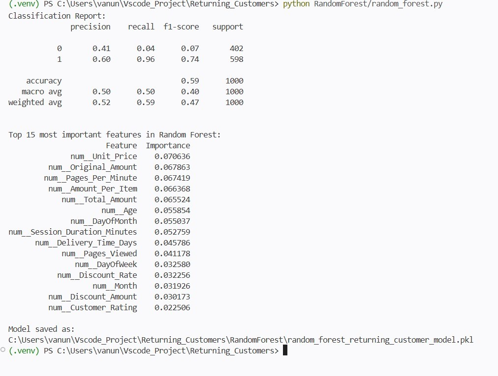
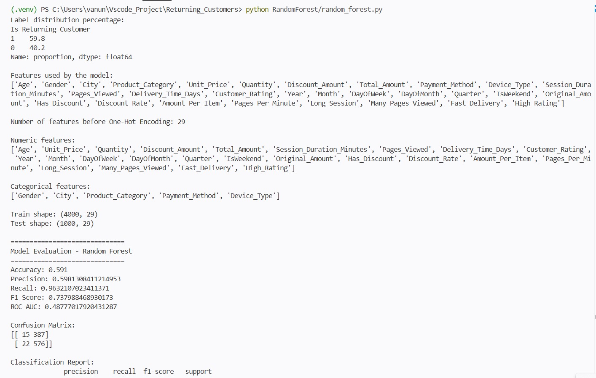
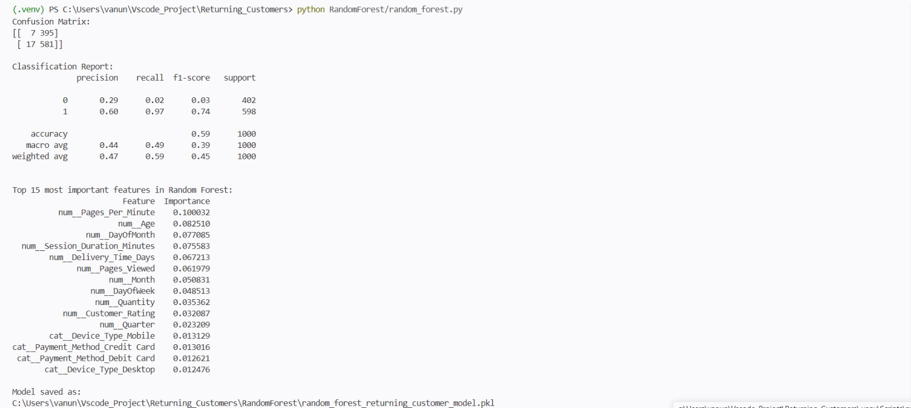

<h1>הנחות יסוד לגבי המודל:</h1>

<ul>
<li>בונה יער המורכב מהמון עצי החלטה אקראיים ובלתי תלויים. כאשר מגיע לקוח חדש כל עץ בנפרד מקבל החלטה וסיווג הלקוח כלקוח חוזר יוכרע לפי רוב העצים.</li>

<li>שואל שאלות של כן/ לא.</li>

<li>כדי שהעצים לא יהיו זהים האלגוריתם מכניס אקראיות לכל עץ - בבחירת הלקוחות שישפיעו עליו (שורות) וכן בחירת המאפיינים שישפיעו עליו מתוך כל המאפיינים (עמודות).</li>

<li>מתאים עבור נתונים שאין בהם קשר לינארי כמו נתוני הצרכנות (כמו גיל אל מול פלטפורמת הגלישה).</li>

<li>כחלק מפלט המודל המאפיינים מדורגים בהתאם לחשיבות שהם לוקחים בהחלטה בין 0-1 (סה"כ של דירוג המאפיינים = 1).</li>
</ul>

<h1>התאמת המודל לדאטה וציפיות:</h1>

מודל זה יאפשר הבנה של חשיבות המאפיינים ואלו מביניהם בעלי השפעה ישירה על רכישות הלקוח.
 
בנוסף לכך מודל זה מתמודד עם ריבוי מאפיינים שלאו דווקא קשורים בקשר לינארי כפי שעולה גם מטבלת הנתונים שלנו.

<h1>דגשים בלוגיקה:</h1>

<ul>
<li>
בדאטה סט יש ערבוב של עמודות מספריות (כמו גיל, מחיר, זמן שהייה באתר) ועמודות קטגוריות/טקסטואליות (כמו מגדר, עיר, סוג מכשיר).
</li>

<li>
ה-ColumnTransformer מאפשר להגדיר "צינורות טיפול" (Pipelines) שונים לחלוטין לכל סוג מידע, ולהריץ אותם במקביל בפקודה אחת:
</li>

<ul>
<li>
למידע המספרי (num): הוא שולח אותם ל-numeric_transformer שממלא ערכים חסרים לפי חציון.
</li>

<li>
למידע הקטגורי (cat): הוא שולח אותם ל-categorical_transformer שממלא ערכים חסרים לפי הערך השכיח ביותר וממיר אותם למספרים בעזרת OneHotEncoder.
</li>
</ul>
</ul>

<h1>ממצאי הרצה:</h1>

<ul>
<li>
דיוק (Accuracy) = המודל מצליח לחזות במדויק האם הלקוח הוא לקוח חוזר או לא ב-59.1% מהמקרים.
</li>

<li>
המודל סיווג נכון 576 לקוחות חוזרים (מתוך 598). זה מעניק לו מדד Recall (רגישות) מטורף של 96%!
</li>

<li>
מצד שני, המודל התקשה מאוד עם לקוחות לא חוזרים – הוא סיווג בטעות 387 לקוחות חדשים כאילו הם לקוחות חוזרים.
</li>

<li>
למאפייני המחירים השפעה גבוהה בקבלת ההחלטה בסיווג.
</li>

<li>
נתון מעניין - למאפייני גלישת הלקוח השפעה ניכרת בסיווג: זמן גלישה בעמוד (6.7%), זמן גלישה (5.2%) ומספר עמודים שנגללו (4.1%).
</li>
</ul>

<h1>שיפורים נדרשים:</h1>

<ul>
<li>
מעניין לבדוק מה יקרה אם נוסיף ל-columns_to_drop את המאפיינים שהתגלו כחזקים ומשפיעים מאוד בהחלטת הסיווג כרגע. מכך נבין כיצד מאפיינים פחות ישירים ממחיר לפריט ברכישה משפיעים על חזרת לקוח.
</li>

<ul>
<li>
הרצה 2 - נסיר תחילה את מאפייני המחירים Discount_rate (3.2%), Unit_Price (7%), Original_Amount (6.7%), Amount_Per_Item (6.6%), Total_Amount (6.5%).
</li>
</ul>
</ul>

<h1>ממצאי הרצה שנייה:</h1>

<ul>
<li>
המודל שמר על Accuracy של 59.1%, מה שמעיד כי גם ללא מאפייני המחירים והסכומים עדיין ניתן לזהות דפוסי חזרה של לקוחות על בסיס התנהגות גלישה ודמוגרפיה.
</li>

<li>
המודל הציג Recall גבוה במיוחד של 96.3%, כלומר הצליח לזהות כמעט את כל הלקוחות שבאמת חזרו לאתר.
</li>

<li>
מצד שני, המודל נטה לסווג גם לקוחות חדשים כלקוחות חוזרים, ולכן נוצר מספר גבוה של False Positives.
</li>

<li>
מטריצת הבלבול הראתה כי:
<ul>
<li>576 לקוחות חוזרים זוהו נכון.</li>
<li>רק 22 לקוחות חוזרים פוספסו.</li>
<li>387 לקוחות חדשים סווגו בטעות כלקוחות חוזרים.</li>
<li>15 לקוחות חדשים בלבד זוהו נכון.</li>
</ul>
</li>

<li>
לאחר הסרת משתני המחירים, המודל נשען בעיקר על מאפייני התנהגות גלישה ודמוגרפיה.
</li>

<li>
המאפיין המשפיע ביותר היה Pages_Per_Minute (12.3%), דבר המצביע על כך שקצב הגלישה של הלקוח הוא אינדיקציה משמעותית לזיהוי לקוח חוזר.
</li>

<li>
מאפיינים משמעותיים נוספים:
<ul>
<li>Age (10.2%)</li>
<li>DayOfMonth (9.8%)</li>
<li>Session_Duration_Minutes (9.4%)</li>
<li>Delivery_Time_Days (8.6%)</li>
<li>Pages_Viewed (7.9%)</li>
</ul>
</li>

<li>
מסקנת הניסוי היא שגם ללא מידע פיננסי, ניתן לזהות לקוחות חוזרים באמצעות דפוסי התנהגות באתר, כאשר קצב הגלישה וגיל המשתמש הם מהמאפיינים המשמעותיים ביותר בהחלטת הסיווג.
</li>
</ul>

<h1>מסקנות:</h1>

<ul>
<li>
<strong>חוסר התלות של המודל במשתנים פיננסיים :</strong> 
העובדה שמדד הדיוק (Accuracy) נותר זהה לחלוטין בשתי ההרצות (59.1%) מוכיחה שמשתני המחיר, הסכומים וההנחות היוו "רעש" (Noise) עבור האלגוריתם, ולא תרמו ליכולת ההכללה (Generalization) שלו על נתוני בדיקה חדשים.
</li>

<li>
<strong>חשיבותם של מדדי ה-Engagement והתנהגות הגלישה:</strong> 
הסרת המשתנים הפיננסיים אילצה את המודל להתבסס על התנהלותו של הלקוח בזמן הרכישה. המעבר של המאפיין <code>Pages_Per_Minute</code> לראש טבלת החשיבות (12.3%) מוכיח כי קצב הגלישה ואופי האינטראקציה עם הממשק הם המנבאים היציבים והאמינים ביותר לזיהוי לקוח חוזר.
</li>

<li>
<strong>עדיפות למשתנים רציפים על פני משתנים בינאריים:</strong> 
נמצא כי המודל העדיף להשתמש במאפיינים רציפים ומדויקים כמו זמן גלישה וכמות עמודים, על פני אינדיקטורים בינאריים כגון <code>Long_Session</code> או <code>Many_Pages_Viewed</code>. הדבר מדגיש את יכולתו של מודל היער האקראי (Random Forest) לזהות בעצמו נקודות פיצול (Splits) אופטימליות מתוך נתונים גולמיים ומספריים, מבלי "לאבד מידע" כפי שקורה בתהליך דיסקרטיזציה ידני.
</li>

<li>
<strong>הטיה מובנית לטובת מחלקת הרוב (Majority Class Bias):</strong> 
מדד ה-Recall המקסימלי (96.3%) לצד מספר ה-False Positives הגבוה (387 לקוחות חדשים שסווגו בטעות כחוזרים) מלמדים כי המודל פיתח נטייה חזקה לסווג לקוחות כחוזרים. תופעה זו נפוצה בעצי החלטה כאשר קיים חוסר איזון (Imbalance) מובנה בדאטה לטובת הלקוחות החוזרים, והאלגוריתם שואף למקסם את אחוזי ההצלחה הכלליים על ידי בחירה במחלקת הרוב.
</li>

<li>
<strong>ערך עסקי ושיווקי ממוקד:</strong> 
מנקודת מבט עסקית, הדומיננטיות של משתנים כמו גיל הלקוח (10.2%), יום בחודש (9.8%) וזמן הגעת המשלוח (8.6%) מעניקה למנהלי הפלטפורמה כלים יישומיים: ניתן לבצע סגמנטציה התנהגותית ואופטימיזציה של מערך הלוגיסטיקה וחוויית השירות (משלוח מהיר בונה נאמנות), במקום להסתמך על אסטרטגיית הנחות ומחירים בלבד.
</li>
</ul>

